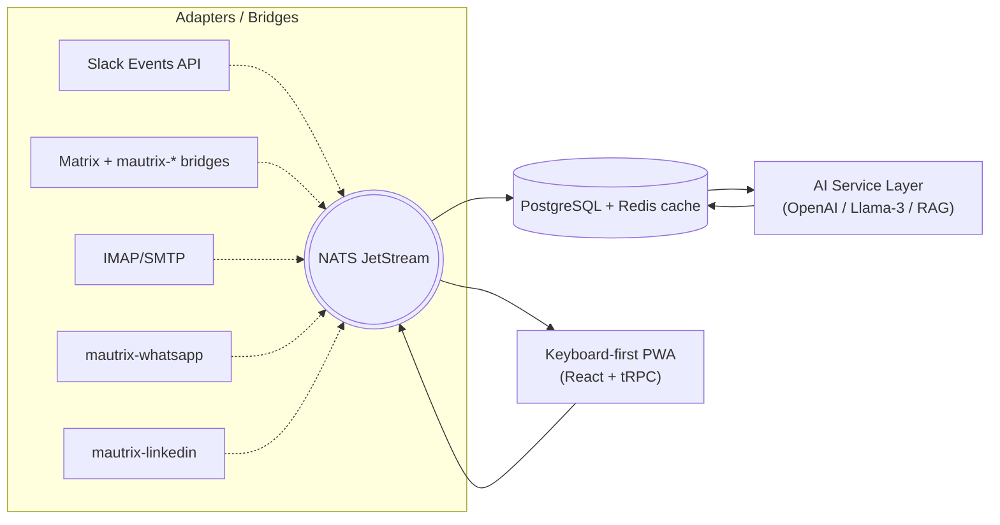

# Flowzo Architecture

This document captures the technical blueprint of Flowzo.  It is kept separate from the roadmap so contributors can discuss design changes without scrolling a long narrative.

---

## 1. System Diagram

### Why NATS First?
* **Simpler Ops** – single binary, embedded JetStream persistence.
* **Local Dev** – works inside `docker-compose` with minimal RAM. 
* **Upgrade Path** – swap to Kafka once traffic exceeds ~1 k msgs/s or multi-region replication is required.

## 2. Data Storage & Security

| Component | Choice | Notes |
|-----------|--------|-------|
| Primary DB | **PostgreSQL 16** | Enable Row-Level Security (RLS) for multi-tenant SaaS.  Use [pg_partman](https://github.com/pgpartman/pg_partman) to partition high-volume event tables by `created_at_month`. |
| Cache / Replay | **Redis** | Use Redis **Streams** for ordered message replay to the UI after reconnect. |
| Object Storage | S3-compatible (MinIO in dev) | For file attachments. |

## 3. API Surface

| Scope | Protocol | Library |
|-------|----------|---------|
| Internal front-end calls | **tRPC** | Tight TS inference; no OpenAPI boilerplate. |
| Polyglot bridge callbacks | **gRPC** | Required for Go/Python bridges to push events. |
| Public Webhooks (future) | HTTPS JSON | Documented via OpenAPI. |

## 4. AI Service Layer

| Model | Tokens/s | Pricing (USD / 1k tokens) | Latency (p95) |
|-------|----------|---------------------------|--------------|
| OpenAI GPT-4o | ~200 | $0.005 | ~1.7 s |
| Mistral 8x22B (hosted) | ~80 | $0.003 | ~2 s |
| Llama-3 70B (self-host) | ~40 | Infra cost, no API fee | ~2.5 s |

All prompts are version-ed in `ai/prompts/*.md`.  A pluggable JSON schema lets the community contribute new prompt packs.

## 5. Observability

* **Structured logging** – JSON, includes `trace_id` propagated from React UI.
* **Metrics** – Prometheus exporter reports bridge latency, error codes, inbox render time.
* **Tracing** – OpenTelemetry spans across NATS, tRPC, Postgres.

> A Grafana dashboard screenshot lives in `docs/images/observability-dashboard.png` (to be updated).

## 6. ADR Index

| # | Title | Status |
|---|-------|--------|
| 001 | Choose NATS over Kafka for MVP | Accepted |
| 002 | Adopt Row-Level Security in Postgres | Draft |
| 003 | Use tRPC for front-end RPC | Draft |

See `docs/adr/` for full text. 